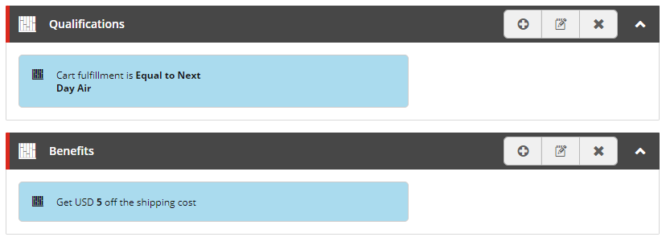

# 

[](https://dev.azure.com/avivasolutions-public/Nyxie/_build/latest?definitionId=6&branchName=master)


Nyxie is a plugin for Sitecore Commerce that extends the Promotion Engine with a number of useful promotion options

It introduces 8 new qualifications and 6 new benefits. In addition these qualifications and benefits are displayed in the business tools in an easy to read way.

## Getting started
1. Download the Sitecore .update package and the .nuget package from the GitHub releases page.
2. Install the .nuget package in a local nuget registry or folder and add it to the Sitecore Commerce Engine project.
3. Install the Sitecore .update package using the Sitecore Control Panel.
4. Synchronze the Commerce Control Panel using the Sitecore Commerce Postman scripts: ContentAPISamples -> DoActions -> Sync content item.
5. The new qualifications and benefits are now available in the business tools.

## How to use

### Qualifications

The following qualifications are part of Nyxie and can be selected in the business tools.

#### Cart contains products in specific category
Will apply the given benefit when the cart contains a product in a specific category.

When a qualification is added to a promotion, the following conditions will be available in the list:

`Cart contains [compares] [specific value] products in the [specific category] category`

| Variable              | Type        | Default value  |Description                     |
| -------------         |-------------| -----          | --------                       |
| compares              | operator    |                |standard operators|
| specific value        | integer     |                |indicates the subtotal of products compared using the configured operator|
| specific category     | category    |                |The name of the category. This is a search box. |
|Include sub categories |bool         |true            |indicates whether sub categories are included|

`Cart contains products in the [specific category] category for a total [compares] $ [specific value]`

| Variable              | Type        | Default value  |Description                     |
| -------------         |-------------| -----          | --------                       |
| compares              | operator    |                |standard operators|
| specific value        | integer     |                |indicates the numer of products compared using the configured operator|
| specific category     | category    |                |The name of the category. This is a search box. |
|Include sub categories |bool         |true            |indicates whether sub categories are included|

> If nothing happens when entering the category name and no categories can be found: make sure the indexes have been build and see the fix indexes paragraph below.

#### Cart has specific fulfillment
Will apply the given benefit when the cart contains a specific fulfillment method.

When a qualification is added to a promotion, the following condition will be available in the list:

`Cart fulfillment is [operator] [specific fulfillment]`

| Variable              | Type        | Default value  |Description                     |
| -------------         |-------------| -----          | --------                       |
|Operator               |operator     | equals         | equals/does not equal          |
|Fulfillment method     |fulfillment method||indicates the fulfillment method compared using the configured operator|

> The qualification will not apply if no fulfillment has been chosen.
> When the cart contains multiple fulfillments, the qualification will apply if any of them match the configured fulfillment method.

#### Cart has specific payment
Will apply the given benefit when the cart contains a specific payment method.

When a qualification is added to a promotion, the following condition will be available in the list:

`Cart payment method is [operator] [specific payment]`

| Variable              | Type        | Default value  |Description                     |
| -------------         |-------------| -----          | --------                       |
|Operator               |operator     | equals         | equals/does not equal          |
|Payment method         |payment method|               |indicates the payment method compared using the configured operator|

> The qualification will not apply if no payment has been chosen.
> When the cart contains multiple payments, the qualification will apply if any of them match the configured payment method.

#### Products in a specific category in order history
Will apply the given benefit when the order history of the customer contains products in a specific category.

When a qualification is added to a promotion, the following conditions will be available in the list:

`Order history contains [compares] [specific value] products in the [specific category] category`

| Variable              | Type        | Default value  |Description                     |
| -------------         |-------------| -----          | --------                       |
|compares               |operator     |                |standard operators              |
|specific value         |integer      |                |indicates the number of products compared using the configured operator|
|specific               |category     |                |a fully qualified category path |
|Include sub categories |bool         | true           |indicates whether sub categories are included|

`Order history contains products in the [specific category] category for a total [compares] $ [specific value]`

| Variable              | Type        | Default value  |Description                     |
| -------------         |-------------| -----          | --------                       |
|compares               |operator     |                |standard operators              |
|specific value         |integer      |                |indicates the subtotal of products compared using the configured operator|
|specific               |category     |                |a fully qualified category path |
|Include sub categories |bool         | true           |indicates whether sub categories are included|

#### Customer first purchase date
Will apply the given benefit when the user is a logged in customer and has placed an order at a given date.

When a qualification is added to a promotion, the following condition will be available in the list:

`Current Customer first purchase is [operator] [date]`

| Variable              | Type        | Default value  |Description                     |
| -------------         |-------------| -----          | --------                       |
|Operator               |operator     |                | standard operator          |
|Date                   |date|                         |indicates the date compared using the configured operator|

`Current Customer last purchase is [operator] [date]`

| Variable              | Type        | Default value  |Description                     |
| -------------         |-------------| -----          | --------                       |
|Operator               |operator     |                | standard operator          |
|Date                   |date|                         |indicates the date compared using the configured operator|

> When comparing dates using the Equal operator, the dates will need to have the same year, month, day, hour, minute, seconds and milliseconds in order for them to be considered equal.

### Benefits

The following benefits are part of Nyxie and can be selected in the bixfix tools.

#### Get a free gift
Will add a free gift to the cart when the given qualification has been met.

When a benefit is added to a promotion, the following action will be available in the list:

`Get [quantity] free [gift]`

| Variable              | Type        | Default value  |Description                     |
| -------------         |-------------| -----          | --------                       |
|Product                | product     |                |the product to add as free gift |
|Quantity               | integer     |1               |the number of products to add   |

> The gift will be removed from the cart when the qualification is no longer met.

#### % discount on every N-th qualifying product
Will apply a fixed amount discount to a number of products, when the specified minimum amount of products are added to the cart.

When a benefit is added to a promotion, the following action will be available in the list:

`For every [Items to award] of [Items to purchase] products in [Category] you get [Percentage Off] on the [Apply Award To] with a limit of [Award Limit]`

| Variable              | Type        | Default value  |Description                     |
| -------------         |-------------| -----          | --------                       |
|Category               |category     |                |a fully qualified category path |
|Include sub categories |bool         |true            |indicates whether sub categories are included|
|Items to purchase      |integer      |                |indicates the number of items (N) to be puchased for the discount to be applied|
|Items to award         |integer      |                |indicates the number of items (X) the discount will be applied to|
|Percentage Off         |decimal      |                |the percentage to deduct from the item price|
|Award Limit            |integer      |                |the maximum number of times the benefit will be applied|
|Apply Award To         |option       |Least Expensive Items First |indicates whether the most of least expensive items will be awarded first: Most Expensive Items First/Least Expensive Items First|

The action will do the following:

1. Select the eligable items
2. Sort the items by most/least expensive
3. Calculate the number of times the discount should be applied
4. Apply the discount to the most/least expensive items

> Cart line quantity is taken into account, meaning that a cart line with a quantity of 10 could have the discount applied twice, resulting in 2 discounted products and 8 at full price.

> Uses the same rounding algorithm as Sitecore uses in its benefits.

> This benefit currently does not support decimals in the quantity

#### $ discount on every N-th qualifying product

Will apply a fixed amount discount to a number of products in a category, when a specified amount of products from that category have been added to the cart.

When a benefit is added to a promotion, the following action will be available in the list:

`For every [Items to award] of [Items to purchase] products in [Category] you get [Amount Off] on the [Apply Award To] with a limit of [Award Limit]`

| Variable              | Type        | Default value  |Description                     |
| -------------         |-------------| -----          | --------                       |
|Category               |category     |                |a fully qualified category path |
|Include sub categories |bool         |true            |indicates whether sub categories are included|
|Items to purchase      |integer      |                |indicates the number of items (N) to be puchased for the discount to be applied|
|Items to award         |integer      |                |indicates the number of items (X) the discount will be applied to|
|Amount Off             |decimal      |                |the amount to deduct from the item price|
|Award Limit            |integer      |                |the maximum number of times the benefit will be applied|
|Apply Award To         |option       |Least Expensive Items First |indicates whether the most of least expensive items will be awarded first: Most Expensive Items First/Least Expensive Items First|

The action will do the following:

1. Select the eligable items
2. Sort the items by most/least expensive
3. Calculate the number of times the discount should be applied
4. Apply the discount to the most/least expensive items

> Cart line quantity is taken into account, meaning that a cart line with a quantity of 10 could have the discount applied twice, resulting in 2 discounted products and 8 at full price.

> Uses the same rounding algorithm as Sitecore uses in its benefits.

> This benefit currently does not support decimals in the quantity

#### Get $ discount on shipping
Will deduct a fixed amount from the shipping costs when the given qualification is met.

When a benefit is added to a promotion, the following action will be available in the list:

`Get [specific amount] off the shipping cost`

| Variable              | Type        | Default value  |Description                     |
| -------------         |-------------| -----          | --------                       |
|Amount Off             |decimal      |                |the amount to deduct from the shipping cost|

#### $ discount on products in a specific category
Will apply a fixed amount discount to a number of products in a category, when a specified amount of products from that category have been added to the cart.

When a benefit is added to a promotion, the following action will be available in the list:

`When you buy [Operator] [Product count] products in [Category] you get [Amount off] per product (ordered by [apply award to]) with a maximum of [award limit] products`

| Variable              | Type        | Default value  |Description                     |
| -------------         |-------------| -----          | --------                       |
|Operator               |operator     |                |standard operators              |
|Product count          |integer      |                |indicates the numer of products compared using the configured operator|
|Category               |category     |                |a fully qualified category path|
|Include sub categories |bool         | true           |indicates whether sub categories are included|
|Amount Off             |decimal      |                |the amount to deduct from the product price|
|Award Limit            |integer      |                |the maximum number of products the benefit will be applied to|
|Apply Award To         |option       |Least Expensive Items First |indicates whether the most of least expensive items will be awarded first: Most Expensive Items First/Least Expensive Items First|

The action will do the following:

1. Select the eligable items
2. Sort the items by most/least expensive
3. Calculate the number of times the discount should be applied
4. Apply the discount to the most/least expensive items

> Cart line quantity is taken into account, meaning that a cart line with a quantity of 10 could have the discount applied twice, resulting in 2 discounted products and 8 at full price.

> Uses the same rounding algorithm as Sitecore uses in its benefits.

#### % discount on products in a specific category
Will apply a percentageamount discount to a number of products in a category, when a specified amount of products from that category have been added to the cart.

When a benefit is added to a promotion, the following action will be available in the list:

`When you buy [Operator] [specific value] products in [specific category] you get [Percentage off] per product (ordered by [apply award to]) with a maximum of [award limit] products`

| Variable              | Type        | Default value  |Description                     |
| -------------         |-------------| -----          | --------                       |
|Operator               |operator     |                |standard operators              |
|Product count          |integer      |                |indicates the numer of products compared using the configured operator|
|Category               |category     |                |a fully qualified category path|
|Include sub categories |bool         | true           |indicates whether sub categories are included|
|Percentage Off         |decimal      |                |the percentage to deduct from the product price|
|Award Limit            |integer      |                |the maximum number of products the benefit will be applied to|
|Apply Award To         |option       |Least Expensive Items First |indicates whether the most of least expensive items will be awarded first: Most Expensive Items First/Least Expensive Items First|

The action will do the following:

1. Select the eligable items
2. Sort the items by most/least expensive
3. Calculate the number of times the discount should be applied
4. Apply the discount to the most/least expensive items

> Cart line quantity is taken into account, meaning that a cart line with a quantity of 10 could have the discount applied twice, resulting in 2 discounted products and 8 at full price.

> Uses the same rounding algorithm as Sitecore uses in its benefits.

## Display of qualification and benefits
To make the qualification and benefits Nyxie introduces more readable by users, each qualification and benefit comes with a custom view that translates it to a single sentence.

# 

## Contributing

### Prerequisites
- Windows 10 update 1809
- Docker for Windows version >= 18.09.1
- Visual Studio 15.5.3

### Setup a development environment
- Open a console en navigate to the repository root folder.

- Build the project in Visual Studio and publish the projects to the following folders
Nyxie.Serialization --> \build\website
Sitecore.Commerce.Engine --> \build\commerce

- Build Sitecore XC Docker images according to the instructions found here: https://github.com/Sitecore/docker-images
    - Or if you have pre-built Docker images available in a registry, set the `REGISTRY` in [](./env)

- Spin up the environment, see [here](https://github.com/Sitecore/docker-images/tree/master/windows/tests/9.3.x#prerequisites-and-considerations) for prerequisites e.g. wrt. use of Sitecore license (make sure you are using Windows and not Linux containers):
```
PS> docker-compose up
```

To set the Docker container service names as DNS names on your host edit your `hosts` file.
A convenient tool to automatically do this is [whales-names](https://github.com/gregolsky/whales-names).

Synchronize the development content by running Unicorn: [http://cm/unicorn.aspx?verb=sync](http://cm/unicorn.aspx?verb=sync).

Initialize your Commerce Engine and setup a Storefront according to the instructions [here](https://github.com/Sitecore/docker-images/tree/master/windows/tests/9.3.x).
> Unselect the Habitat catalog in `Commerce > Catalog Management > Catalogs` before adding a Storefront site

Fix indexes by:

- Opening the content editor
- Make sure the Habitat catalog is selected in the Commerce Control panel
- Goto the commerce tab
- Delete Data Templates
- Update Data Templates
- Goto control panel and rebuild the `sitecore_master_index` & `sitecore_sxa_master_index`

> If you get an error saying: 'field _indexname' not found: remove files in host [](./data/solr) folder. Restart containers and populate schema.

## Known issues
- For the category related qualifications and benefits to work we need to add a custom component to the cart line when a product is added. This component adds the category path and in order to determine this path it uses the Sitecore Item API. This call to the Item API is not ideal and we should try to determine the category path without the call.

## Resources
https://sitecoresmurf.wordpress.com/2019/07/18/known-issues-limitations-and-extending-promotion-plugin-in-sitecore-commerce-9/
Out of the box, sitecore doesn't allow boolean values in Conditions.
To change this behavior we made our own version of the BuildRuleSetBlock in which we called our own SitecoreExtensions.ConvertToConditionExtended and SitecoreExtensions.ConvertToActionExtended.
